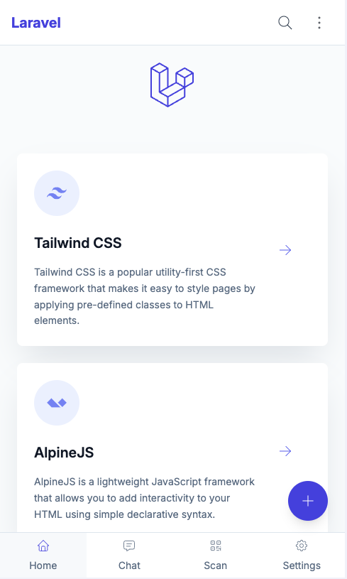
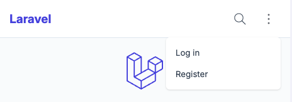
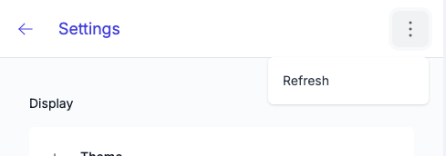
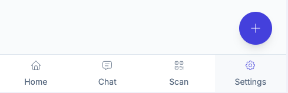
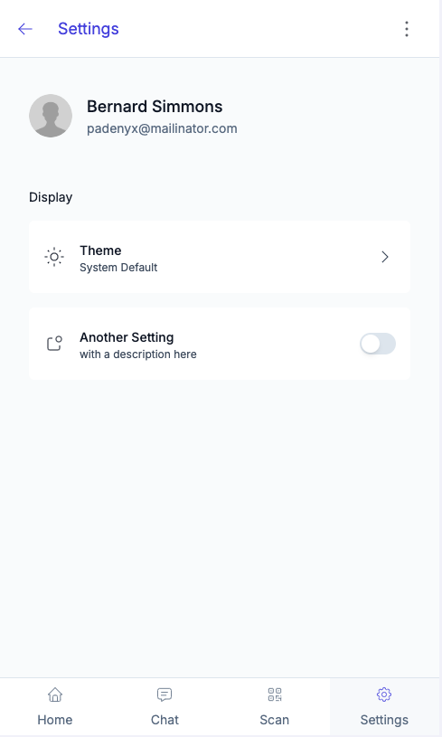
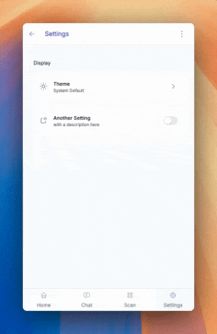

# Laravel TALL Preset with Mobile Elements

[](https://packagist.org/packages/stitch-digital/laravel-simpro-api)
[](https://packagist.org/packages/johntrickett86/tall-mobile)

The TALL stack preset you know and love - with a few extra mobile elements.

If you're not familiar with the name, it's an acronym that describes the main technologies involved in the stack:
- [Tailwind CSS](https://tailwindcss.com)
- [Alpine.js](https://alpinejs.dev/)
- [Laravel](https://laravel.com)
- [Livewire](https://livewire.laravel.com)



Some notable features of this package include:
- Everything you know and love from the Laravel TALL Preset package
- A mobile UI experience
- Floating action button
- Theme selector (System, Light, Dark)
- Ability to hide header and toolbar when scrolling

> **Note**: If you're looking for an application boilerplate that supports the TALL stack, you should check out [Laravel Jetstream](https://github.com/laravel/jetstream). It comes with authentication scaffolding, account management, teams support.

## Installation

This preset is intended to be installed into a fresh Laravel application. Follow [Laravel's installation instructions](https://laravel.com/docs/installation) to ensure you have a working environment before continuing.

### Installation (without auth)

Then simply run the following commands:
```bash
composer require livewire/livewire johntrickett86/tall-mobile
php artisan ui tall
npm install
npm run dev
```

### Installation (with auth)

If you would like to install the preset and its auth scaffolding in a fresh Laravel application, make sure to use the `--auth` flag on the `ui` command:

```bash
composer require livewire/livewire johntrickett86/tall-mobile
php artisan ui tall --auth
php artisan migrate
npm install
npm run dev
```

Some notable features of the authentication scaffolding include:
- Powered by Livewire components and single action controllers
- Bundled with pre-written tests

All routes, components, controllers and tests are published to your application. The idea behind this is that you have full control over every aspect of the scaffolding in your own app, removing the need to dig around in the vendor folder to figure out how things are working.

## CSS purging

Tailwind uses PurgeCSS to remove any unused classes from your production CSS builds. You can modify or remove this behaviour in the `purge` section of your `tailwind.config.js` file. For more information, please see the [Tailwind documentation](https://tailwindcss.com/docs/controlling-file-size/).

## Removing the package

If you don't want to keep this package installed once you've installed the preset, you can safely remove it. Unlike the default Laravel presets, this one publishes all the auth logic to your project's `/app` directory, so it's fully redundant.


### A note on pagination

If you are using pagination, you set the default pagination views to the ones provided in the `boot` method of a service provider:

```php
use Illuminate\Pagination\Paginator;
use Illuminate\Support\ServiceProvider;

class AppServiceProvider extends ServiceProvider
{
    public function boot()
    {
        Paginator::defaultView('pagination::default');

        Paginator::defaultSimpleView('pagination::simple-default');
    }
}
```

# Mobile Elements

## Icons

This package uses the [Blade Tabler Icons](https://github.com/ryangjchandler/blade-tabler-icons) package by [Ryan Chandler](https://github.com/ryangjchandler).

You'll notice that we pass icon names through various props - it is Tabler icon names that we are using, however you can use any icon set you like.

Check out the available icons on the [Tabler Icons website](https://tabler.io/icons).

## Header Components

There are two header components included in this package.

### Main Header

The first is the `mobile-header-main` component, which is the default header component designed to be show on the main page of the application.

It includes a section for customising menu items, including a dropdown menu:



This component has a prop that can be used to dynamically hide the header when scrolling:

```php
<x-partials.headers.mobile-header-main :scroll-hide="true" /> // hides the header when scrolling down
<x-partials.headers.mobile-header-main :scroll-hide="false" /> // fixes the header to the top of the page
```

### Page Header

The second header component is the `mobile-header-page` component, which also allows for customised header items. You can use this as a template to create additional page headers and rename them accordingly.



This component has the same prop as the main header, but also the ability to customise the title:

```php
<x-partials.headers.mobile-header-main :scroll-hide="true" title="Settings" /> // hides the header when scrolling down
<x-partials.headers.mobile-header-main :scroll-hide="false" title="Settings" /> // fixes the header to the top of the page
```

## Toolbar

The toolbar component is designed to be used at the bottom of the page and includes an optional floating action button.



### Toolbar Navigation Items

You can update the toolbar items by updating the mobile-toolbar blade component:

```php
// Update the number of grid columns to match the number of toolbar items
<div class="grid h-full w-full grid-cols-2">

        <x-elements.toolbar-button
                :href="route('home')"
                :active="request()->routeIs('home')"
                icon="home"
                label="Home"
        />
        
        <x-elements.toolbar-button
                :href="route('settings')"
                :active="request()->routeIs('settings')"
                icon="settings"
                label="Settings"
        />
        
</div>
```

### Floating Action Button

The floating action button is an optional element that can be included in the toolbar. It is designed to be used as a primary action button for the page.

There are some props you can pass to the component:

```php
// Modal Example
<x-toolbar
        :scroll-hide="true" // hides the toolbar when scrolling down
        :fab="true" // shows the floating action button
        fabIcon="plus" // the icon to show in the floating action button
        fabType="modal" // can be modal or link
        modal-name="fab-modal" // the name of the modal blade component
    />

// Link Example
<x-toolbar
        :scroll-hide="false" // fixes the toolbar to the bottom of the page
        :fab="true" // shows the floating action button
        fabIcon="arrow-right" // the icon to show in the floating action button
        fabType="link" // can be modal or link
        :href="route('home')"
    />
```

> **Important note about modals**:
> 
> When specifying a modal name, this should match a blade component in the `resources/views/modals` directory. We have put a blank one in there to get you going.

## Settings Page

We have also included a skeleton settings page.



### User and Avatar

If a user is logged in, the user's name and avatar will be displayed in the header. If no user is logged in, a default avatar will be shown.

We have added a migration to include 'avatar_url' to the users table.

> **Remember**: To use the avatar_url, update your user model to make this field fillable!

### Theme Selector

Switches the theme between System, Light and Dark.



## Theme Customisation

The theme is customisable by updating the `tailwind.config.js` file. We have based the colors on named colors which can be easily updated:

```
theme: {
    extend: {
        colors: {
            transparent: 'transparent',
                current: 'currentColor',
                primary: colors.indigo,
                secondary: colors.emerald, // not currently used
                danger: colors.red, // not currently used
                success: colors.green, // not currently used
                warning: colors.amber, // not currently used
                info: colors.blue, // not currently used
                light: colors.slate,
        },
    },
},
```

Replacing the primary or light color will reflect in the current Tailwind styles.

## Credits

- [John Trickett](https://github.com/johntrickett86)
- [Dan Harrin](https://github.com/DanHarrin) for the TALL stack preset package this is based on
- [Liam Hammett](https://github.com/imliam) for the TALL stack preset package this is based on
- [Ryan Chandler](https://github.com/ryangjchandler) for the TALL stack preset package this is based on and for the wonderful Blade Tabler Icons package
- [Tailwind UI](https://tailwindui.com) for the default authentication and pagination views
- [All Contributors](../../contributors)
